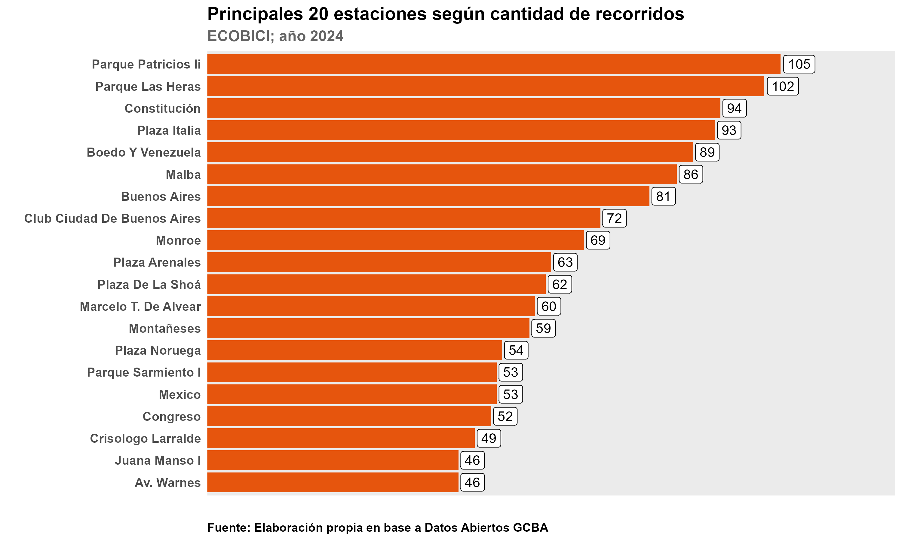
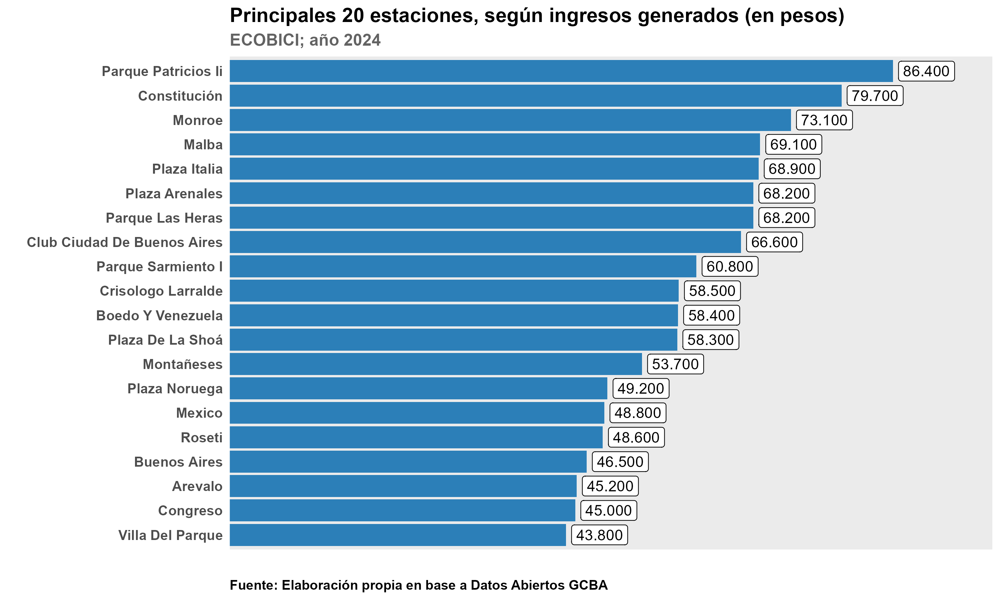

```{r setup, include=FALSE}
knitr::opts_chunk$set(echo = TRUE)
```

\pagebreak

# PRIMERA PARTE DEL TRABAJO

## Introducción

El servicio de _ECOBICIS_ es un sistema de bicicletas públicas ofrecidas por el Gobierno de la Ciudad de Buenos Aires **(GCBA)** que funciona desde el año 2010.

Desde el momento en que comenzó a funcionar el sistema, el mismo fue presentando mutaciones en diferentes aspectos:
  
  - Se pasó de un sistema de manual y presencial a uno completamente automatizado (en la actualidad el retiro de las bicletas requiere de la utilización de la app de Ecobici).
  
  - Se fue aumentando el stock y las prestaciones de las bicicletas (hoy en día todas poseen GPS)
  
  - En 2018 se concesionó el servicio, siendo la empresa brasilera **TEAMBICI** la que ganó la licitación (y la ostenta hasta la actualidad).
  
  - Finalmente, uno de los cambios más relevantes se produjo en 2020, cuando se aranceló parcialmente el servicio, teniendo que pagar los no residentes un importe por la utilización de las bicicletas.


Si bien el servicio de _ECOBICI_ viene demostrando un exitoso desempeño (si se toma como parámetro la evolución de unidades y estaciones disponibles, los usuarios y viajes realizados), tanto desde el GCBA como desde TEAMBICI se busca realizar modificaciones en el servicio, en pos de mejorar la experiencia para los usuarios, incrementar la penetración del servicio y mejorar los márgenes de ganancia del Gobierno y la empresa a cargo de la concesion.

Establecido dicho norte, se buscará realizar un estudio que de cuenta tanto del volumen de la utilización de ECOBICI, como del perfil de los usuarios/viajes realizados. Esto permitirá llevar a cabo acciones orientadas a satisfacer los objetivos planteados en el párrafo anterior.

Si bien este trabajo **parte de una situación hipotética**, los principales insumos prevendrán de bases de datos de ECOBICI en el sitio de [datos abiertos del GCBA](https://data.buenosaires.gob.ar/).

El grueso de los campos y registros procesados provendrán de las bases del dataset de datos abiertos GCBA, sin embargo, se incluirán campos ficticios, con el fin de poder profundizar el uso de SQL. Cuando esto suceda, será debidamente aclarado.

\pagebreak

## Objetivos

A través del uso del herramental ofrecido por SQL en las bases de datos mencionadas, se buscará:

 * Describir el perfil de los usuarios de ECOBICI (sexo, edad, con la posibilidad de incluir el campo _residencia_).
 
 * Calcular el volumen de usuarios / recorridos realizados y su evolución en el tiempo
 
 * Caracterizar los recorridos realizados (barrio y estación de origen, momento en el que se realizó el viaje, duración temporal, distancia recorrida).
 
 * Evaluar las calificaciones otorgadas al recorrido realizado (el campo de calificación del viaje será ficticio), de manera tal de buscar relaciones entre la calificación y variables como: modelo de bicicleta utilizado o estacíon de origen.
 
 * Relacionar perfiles de usuario con el volumen de uso de ECOBICI, con el fin de desarrollar estrategías de penetración del servicio.
 
 * Estimar cuál habría sido el volumen de ingresos generados por la ECOBICI en caso de haber sido un servicio tarifado para toda la población en 2024.

\pagebreak

## Primeras tablas

## Tablas a presentar en la primera entrega

En esta primera entrega, se generaran las siguientes tablas:

 **GENERO:** 

Esta tabla se utilizará para etiquetar al campo _genero_ en las futuras consultas. Se establece como Primary Key _id_genero_ y se relacionará con el _id_genero_ de la tabla **usuarios.**


| Nombre Campo  | Abreviatura | Tipo de datos | Tipo de clave  |
|:--------------|:-----------:|:-------------:|:--------------:|
| id  del genero | id_genero | INT | PK|
| genero  | genero_usuario | VARCHAR (10) | -      |


 **USUARIOS:** 

Esta tabla se utilizará para aportar información del usuario en la tabla de **recorridos**, se vinculará a través de la primary key _id_usuario_.

| Nombre Campo  | Abreviatura | Tipo de datos | Tipo de clave  |
|:--------------|:-----------:|:-------------:|:--------------:|
| id  del usuario | id_usuario | INT | PK|
| id del genero  | genero_usuario | INT | FK      |
| edad  | edad_usuario | INT  | -      |
| fecha de inscripción en ECOBICI  | fecha_alta | DATE | -      |
| hora de la fecha del alta  | hora_alta | TIME | -      |


 **COMUNA:** 

Esta tabla se utilizará para etiquetar al campo _comuna_ en las futuras consultas. Se establece como Primary Key _id_comuna_ y se relacionará con el _id_comuna_ de la tabla **barrios.**


| Nombre Campo  | Abreviatura | Tipo de datos | Tipo de clave  |
|:--------------|:-----------:|:-------------:|:--------------:|
| id  de la comuna | id_comuna | INT | PK|
| nombre de la comuna  | nombre_comuna | VARCHAR (10) |  -     |


 **BARRIO:** 

Esta tabla se utilizará para etiquetar al campo _barrio_ y aportar información de los barrios en las futuras consultas. Se establece como Primary Key _id_barrio_ y se relacionará con el _id_barrio_ de la tabla **recorridos.**

| Nombre Campo  | Abreviatura | Tipo de datos | Tipo de clave  |
|:--------------|:-----------:|:-------------:|:--------------:|
| id  del barrio | id_barrio | INT | PK|
| nombre del barrio  | nombre_barrio | VARCHAR (40) | - | 
| id  de la comuna  | id_comuna | INT |  FK     |
| cantidad de habitantes del barrio  | poblacion | INT |  -     |
| cantidad de habitantes mujeres del barrio  | poblacion_fem | INT |  -     |
| cantidad de habitantes varones del barrio  | poblacion_masc | INT |  -     |


 **ESTACIONES:** 

Esta tabla se utilizará para etiquetar al campo _estacion_ en las futuras consultas y para aportar información de las estaciones. Se establece como Primary Key _id_estacion_ y se relacionará con el _id_estacion_ de la tabla **recorridos.**

| Nombre Campo  | Abreviatura | Tipo de datos | Tipo de clave  |
|:--------------|:-----------:|:-------------:|:--------------:|
| id  de la estacion de bici | id_estacion | INT | PK|
| nombre de la estación  | nombre | VARCHAR (40) | - | 
| dirección de la estación  | direccion | VARCHAR (60) | - |
| id del barrio  | id_barrio | INT |  FK     |
| latitud de la estación  | latitud | DECIMAL(9,6) |  - |
| longitud de la estación  | longitud | DECIMAL(9,6)  | - |

 **MODELO:** 

Esta tabla se utilizará para etiquetar al campo _modelo_ (de la bicicleta) en las futuras consultas. Se establece como Primary Key _id_modelo_ y se relacionará con el _id_modelo_ de la tabla **recorridos.**

| Nombre Campo  | Abreviatura | Tipo de datos | Tipo de clave  |
|:--------------|:-----------:|:-------------:|:--------------:|
| id  del modelo de la bici | id_modelo | INT | PK |
| nombre del modelo de la bici  | modelo | VARCHAR (10) | - | 


 **MESES:** 

Esta tabla se utilizará para etiquetar al campo _mes_ en las futuras consultas. Se establece como Primary Key _id_mes_ y se relacionará con el _id_mes_ de la tabla **recorridos.**


| Nombre Campo  | Abreviatura | Tipo de datos | Tipo de clave  |
|:--------------|:-----------:|:-------------:|:--------------:|
| id  del mes | id_mes | INT | PK |
| nombre del mes del año  | mes | VARCHAR (15) | - | 


 **PRECIOS:** 


Esta tabla se utilizará para etiquetar al campo _precio_ en las futuras consultas. Se establece como Primary Key _id_mes_ y se relacionará con el _id_mes_ de la tabla **recorridos.**


| Nombre Campo  | Abreviatura | Tipo de datos | Tipo de clave  |
|:--------------|:-----------:|:-------------:|:--------------:|
| id  del precio | id_precio | INT | PK |
| precio sugerido por el cobro del servicio  | precio | INT | - | 


\pagebreak

 **RECORRIDOS:** 

Esta tabla aportará información del _recorrido_, relacionándose con las tablas anteriormente descritas.


| Nombre Campo  | Abreviatura | Tipo de datos | Tipo de clave  |
|:--------------|:-----------:|:-------------:|:--------------:|
| id  del recorrido realizado | id_recorrido | INT | PK|
| id del usuario  | id_usuario | INT | FK | 
| id de la estacion de origen  | id_estacion_orig | INT |  FK     |
| id del mes en que se produce el recorrido  | id_mes | INT |  FK     |
| fecha en que se retira la bici  | fecha_origen | DATETIME |  -     |
| id de la estacion de destino  | id_estacion_dest | INT |  FK     |
| fecha y hora en que se produce el retiro  | fecha_dest | DATETIME | -     |
| id del modelo de la bici utilizada  | id_modelo | INT | FK     |
| calificación de la experiencia de uso de la bici  | calificacion | INT | -  |
| id del precio que se debería haber pagado por la bici  | id_precio | INT | FK |

\pagebreak

## Resultados esperados

A través de la utilización de las bases mencionadas, a priori (ya que a futuro se irán modificando los objetivos o sumando nuevas propuestas), se espera realizar vía SQL las siguientes consultas / vistas:

 * Cantidad de usuarios por sexo
 * Cantidad de usuarios por edad
 * Recorridos por sexo
 * Recorridos por edad
 * Cantidad de recorridos por estación
 * Cantidad de recorridos por barrio
 * Calificación del recorrido por estación
 * Recorridos por tipo de modelo de bicicleta utilizada
 * Calificación promedio otorgada por modelo de bicleta
 * Ingresos que se podrían haber generado por la utilización del servicio por barrio
 * Ingresos que se podrían haber generado por la utilización del servicio por estación
 * Usuarios que hubiesen gastado más en el servicio (se podrá selecciónar a los quintiles más altos)
 * Kilometros recorridos por estación
 * Kilometros por sexo
 * Kilometros por edad
 * Kilometros por estación
 * Minutos de recorrido por estación de origen
 * Minutos de recorrido por sexo
 * Minutos de recorrido por edad
 * Minutos de recorrido por estación de origen
 
**A futuro, se incorporarán consultas que implicarán el cruce de una mayor cantidad de variables**, como por ejemplo cantidad de recorridos por sexo, según estación.

## Diagrama de Entidad Relación
 
 
```{r echo=FALSE, out.width="70%", fig.align='center'}


```
 
# SEGUNDA PARTE

En esta segunda entrega se presentarán las primeras **Vistas**, **Funciones**, **Store Procedures** y **Triggers**; los cuales fueron elaborados con el fin de satisfacer los objetivos propuestos en la primera entrega. Tal como se aclaró en la misma, los resultados son preliminares y **se espera expandir la cantidad de productos entregados en la entrega final.**

## Las bases de datos utilizadas

El query generado para la primera entrega (query _1_tabla_relaciones_) permitía generar las tablas del esquema junto con las relaciones entre las mismas . 

Luego de correr ese query, se deben cargar las dos bases comprimidas de recorridos y usuarios **(en la carpeta bases_2da_entrega del repositorio).**

Con respecto a esas bases, se debe aclarar que no son bases completas, dada la cantidad de registros de las mismas (la base completa de usuarios tiene **un total de 247 mil casos**, mientras que el total de registros en la base de recorridos del 2024 **asciende a 3.31 millones**) se realizaron dos bases de muestra, que serán de utilidad para comprobar el buen funcionamiento de las tablas, relaciones, vistas, funciones, store procedures y triggers propuestos.

Para importar las dos tablas se **utilizó el asistente gráfico de MySQL Workbench** (se debe hacer click derecho sobre la tabla usuarios/recorridos; poner "table data import wizard"; abrir las bases descomprimidas; poner "use existing table" y seleccionar ecobici.usuarios/ecobici.recorridos; clickear "next" en las dos ventanas que emergen).

## Descripción de las Vistas

En esta segunda entrega, se presentan 14 vistas:

  **1) vista_recorridos_x_edad:**
  
  _Objetivo:_ presentar una frecuencia de recorridos según edad de los usuarios
  
  _Tablas involucradas:_ recorridos; usuarios

  **2) vista_recorridos_porc_getario:**
  
  _Objetivo:_ distribuir los recorridos por grupo etario, con absolutos y porcentajes
  
  _Tablas involucradas:_ recorridos; usuarios.

  **3) vista_recorridos_porc_genero:**
  
  _Objetivo:_ distribuir los recorridos por genero, con absolutos y porcentajes
  
  _Tablas involucradas:_ recorridos; usuarios; genero.

  **4) recorridos_porc_genero_edad:**
  
  _Objetivo:_ distribuir los recorridos por genero y edad, con absolutos y porcentajes
  
  _Tablas involucradas:_ recorridos; usuarios; genero.
  
  **5) vista_calificaciones_modelo:**
  
  _Objetivo:_ obtener la calificación promedio por cada tipo de modelo de bicicleta
  
  _Tablas involucradas:_ recorridos; modelo

  **6) vista_calificacion_barrio:**
  
  _Objetivo:_ obtener la calificación promedio por barrio de origen del recorrido
  
  _Tablas involucradas:_ recorridos; estaciones; barrio

  **7) vista_recorridos_x_est:**
  
  _Objetivo:_ obtener la cantidad de recorridos por estacion
  
  _Tablas involucradas:_ recorridos; estaciones
  
  **8) vista_recorridos_x_est:**
  
  _Objetivo:_ obtener la cantidad de recorridos por estacion
  
  _Tablas involucradas:_ recorridos; estaciones  

  **9) vista_top_estacion:**
  
  _Objetivo:_ obtener la estación con mayor cantidad de recorridos
  
  _Tablas involucradas:_ recorridos; estaciones  
  
  **10) vista_usuarios_genero:**
  
  _Objetivo:_ conocer la distribución de usuarios por genero
  
  _Tablas involucradas:_ usuarios; genero    
  
  **11) vista_usuarios_edad:**
  
  _Objetivo:_ conocer la distribución de usuarios por edad
  
  _Tablas involucradas:_ usuarios; genero    


  **12) vista_ganancias:**
  
  _Objetivo:_ conocer los ingresos totales que podría haber generado el servicio
  
  _Tablas involucradas:_ recorridos; precio    

  **13) vista_ingresos_est:**
  
  _Objetivo:_ conocer los ingresos totales que podría haber generado el servicio, según estación
  
  _Tablas involucradas:_ recorridos; estaciones; precio    

  **14) vista_km_x_reco:**
  
  _Objetivo:_ conocer la cantidad de kilómetros por recorrido (utilizando el dato de latitud y longitud de las estaciones de origen y destino).
  
  _Tablas involucradas:_ recorridos; estaciones    


## Funciones

En esta etapa del trabajo se generaron **dos funciones:**

  **1) fn_dif_tiempo_minutos:**
  
  _Objetivo:_ La tabla de recorridos ofrecida por el portal de datos abiertos de CABA ofrece una fecha de origen y una de destino (ambos campos con una precisión de fecha, hora, minutos y segundos). La función generada permite **conocer la duración en minutos de cada recorrido.**
  
  _Tablas involucradas:_ recorridos
  
**2) fn_dif_tiempo_minutos:**
  
  _Objetivo:_ Al calcular el promedio de calificaciones otorgadas a cada barrio, esta función **permite realizar un monitoreo de la calidad del servicio ofrecido por cada barrio.**
  
  _Tablas involucradas:_ recorridos; estaciones; barrios
  

## Store Procedures

Se presentan, por el momento, dos Store Procedures:

**1) estaciones_por_barrio:**
  
  _Objetivo:_ Ofrecer un listado de estaciones por cada barrio, seleccionando a cada barrio por su id_barrio devuelve el nombre del barrio, la comuna a la que pertenece, el nombre de cada estación y la dirección.
  
  _Tablas involucradas:_ estaciones; barrios; comunas

**2) recorridos_usuario:**
  
  _Objetivo:_ Listar los recorridos realizados por cada usuario. La selección de cada usuario (a partir de su id) arroja una tabla con las principales características de los recorridos realizados (fecha de inicio de viaje, estación de origen, barrio, comuna, dirección y calificación otorgada).
  
  _Tablas involucradas:_ recorridos;usuarios; genero; estaciones; barrio; comuna


## Triggers

El sistema de Ecobicis es dinámico, constantemente se van sumando nuevos usuarios al sistema (y se van descartando los usuarios que no respetan las reglas de uso de las bicicletas -tiempos de viaje excesivos o daños a las unidades). 

Por estos motivos, es necesario generar triggers que registren las altas y bajas de usuarios del sistema.

Con ese fin se generaron dos triggers:

  **-tr_auditoria_usuarios** 
  
  **-tr_auditoria_usuarios_eliminados**

Estos triggers hacen que se registren en la tabla _auditoria_usuarios_ el id_usuario, id_genero, edad del usuario, fecha y hora de modificacion (del alta o baja), el usuario (data entry) que realizó el alta/baja y un comentario en el que se aclara si se realizó un alta o una baja.

Algo similar sucede con las estaciones, el GCBA preveé la incorporación de nuevas estaciones y la baja de las estaciones que no registren una cantidad significativa de recorridos. Entonces, se agregaron al esquema los siguientes triggers...

  **-tr_auditoria_estaciones** 
  
  **-tr_auditoria_estaciones_eliminadas**

... que registran en la tabla _auditoria_estaciones_ el id_estacion, nombre, dirección, fecha y hora de alta/baja, el data entry que realizó la acción y el comentario que especifica si se trata de un alta o una baja.

\pagebreak

# TERCERA PARTE

## Transacciones

Se incluyeron tres ejemplos para poner en práctica el uso de transacciones en el esquema realizado.

**1) Commit:**

En la tabla _usuarios_ se insertó un nuevo usuario utilizando el comando _commit_ (con la previa desactualización del _autocommit_)

Se agregó un ejemplo similar con la actualización de la edad del nuevo usuario generado (utilizando el comando -update_).

**2) Rollback:**

En la tabla _estaciones_ se inició una transacción para insertar una nueva estación. Luego se realizó otra transacción en la que nueva estación se eliminaba, pero fue restituída a través de un _rollback_.

**3) Savepoint:**

En la tabla de _recorridos_ se modificaron las calificaciones otorgadas a dos recorridos realizados. 

Se aplicó un savepoint al modificar la primera calificación y luego de modificar la segunda calificación se aplició el comando _rollback to_ el savepoint realizado. De esta manera, la calificación del primer caso fue modificada y la del segundo mantuvo el valor original.

Luego de realizar los tres ejercicios, se seteo el autocommit para que quede activado.

## Back Up del esquema

Con el fin de garantizar la seguridad del esquema trabajado, se realizó un un _back up_ de los archivos involucrados.

Para eso, se realizaron los siguientes pasos: en _Administration_ se seleccionó _data export_ el esquema _ecobici_ y se optó por generar un _self contained file_ (un único archivo sql con toda la información seleccionada). El back up de nombre **Dump_ecobici_20250920** fue guardado en la carpeta _back_up_ del proyecto.

## Informes gráficos

Como punto final del trabajo, se presentan algunos gráficos con resultados que surgieron de las vistas generadas. 

Las tablas fueron exportadas desde **MySQL Workbench** en formato .csv.

En el primer gráfico se puede apreciar como en la muestra de usuarios seleccionados, predominan los de género másculino. Otro punto a destacar es que el 7,8% de la muestra completó la categoría "otros" a la hora de registrarse.

 
```{r echo=FALSE, out.width="90%", fig.align='center'}


```

Tal como se puede apreciar a continuación, 4 de cada 10 usuarios tienen entre 26 y 35 años, seguidos por los que tienen entre 36 y 50 años. 

 
```{r echo=FALSE, out.width="90%", fig.align='center'}


```

En el top 20 de estaciones, se destacan "Parque Patricios II", "Parque Las Heras", "Constitución" y "Plaza Italia" como las que mayor cantidad de recorridos concentraron en el año.
 
 
```{r echo=FALSE, out.width="90%", fig.align='center'}



```


 
```{r echo=FALSE, out.width="90%", fig.align='center'}


```


 
```{r echo=FALSE, out.width="90%", fig.align='center'}



```


